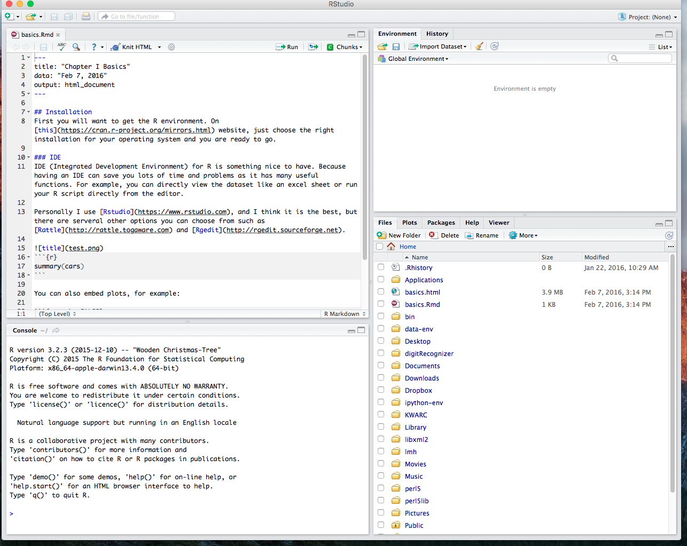

# Chapter I Basics
## Installation 
First you will want to get the R environment. On [this](https://cran.r-project.org/mirrors.html) website, just choose the right installation for your operating system and you are ready to go.

## IDE 
IDE (Integrated Development Environment) for R is something nice to have. Because having an IDE can save you lots of time and problems as it has many useful functions. For example, you can directly view the dataset like an excel sheet or run your R script directly from the editor.

Personally I use [Rstudio](https://www.rstudio.com), and I think it is the best, but there are several other options you can choose from such as [Rattle](http://rattle.togaware.com) and [Rgedit](http://rgedit.sourceforge.net).



On the top left is the editor for your rScript. On the bottom left is the R Console where you can run the script. On the top right is a list of variables and environment values and on the bottom right is your current directory. If you want to run any particular segment of your R script, you can just highlight that segment and click the run bottom on the top, so that it will be run in your console. 

## R Basics  
Now we can start talking about the R basics and get your hands dirty. I highly suggest you follow along to get yourself more familiar with working with R because R is famous for being unfriendly to newcomers. Even some of my friends who study computer science had a difficult time getting started with R. 

### Basic Data Types 
Before we can make complex analysis using R, we want to know the elements of R just like if we want to cook a dish, we need to know about the ingredients first and then comes to recipe. In the world of R, everything has a type and there are five basic data types: 

#### 1. Numeric 
Decimals values are called numeric and it is the default data type
```{r, collapse=TRUE}
x = 3.21
class(x)
x = 3
class(x)
```
We first set x to be 3.21 and the class function tells us which datatype on object is.

#### 2. Integer
Integers cannot be decimals
```{r, collapse=TRUE}
x = as.integer(5)
class(x)

x = 3.2
class(x)

x = as.integer(3.2)
x
class(x)
```
For the second 3.2 assignment, because we first cast it into an integer so the decimal part is truncated.

#### 3. Logical
```{r, collapse=TRUE}
a = TRUE
b = FALSE
a & b
```

#### 4. Character 
```{r, collapse=TRUE}
my_char = "Hello"
class(my_char)
numAsChar = as.character(3.2)
class(numAsChar)
```
After knowing most of the basic datatypes, we can move one step forward.

#### 5. Vector 
```{r}
v <- c("a", "b", "c", "d", "e")
```

Use index to do subsetting:
```{r}
v[2:4]
v[3:length(v)]
```

We can also use logical values to do subsettings:
```{r}
k = v == "c"
v[k]
```


#### Dataframe 
You may be wondering how those things are going to help me analyze data, and why do we need those datatypes at all? I hope you will find your answers as we progress. You know, having just one variable is boring, can we create a list of them? Yes we can by using vector and later you will find out how to can put multiple vectors together to create a dataframe which is essentially our dataset.

Creating a vector is simple you just need to use the c(...) command.
```{r, collapse=TRUE}
a = 2
b = "second"
c = 3.2
my_vector = c(a, b, c, 3.3)
my_vector
```
We first create a couple variables, and then we put them all into my_vector.

Good now, imagine we have many vectors being put together, and we will get our dataframe!
```{r, collapse=TRUE}
name = c("R", "Python", "Matlab")
yearOfCreation = c(1993, 1989, 1970)
awesomeness = c("Oh yeah", "Ok", "Excuse me?")
df = data.frame(name, yearOfCreation, awesomeness)
df
```
First we have a vector of programming languages, then we have a vector of numeric that entail when each language was created, in the end we give some of our opinions about each language. Hence, we can put those vectors into one big chunk, the dataframe. The layout of the dataframe looks like something we see in data analysis project. 

Having learning the R basics and the some essential foundation of R, in the next chapter we can finally start exploring the true power of R by doing some exploratory analysis and find out the correlation between different variables in our data frame.

### Exercies 
#### Exercies I
Note: Use *typeof* function to find out the solution.
What are of the types of following variables:

```{r}
a = 1.0 + 2.0
b = 1.0 + 2
c = 1 + 2.0 
d = 1 + 2
e = 3.0 / 2
f = 3 / 2.0
```

#### Problem II
Note: Use *typeof* or *class* function to find out the solution.
What are of the types of variable School and Composition and why?:

```{r}
library(MASS)
head(painters)
```

