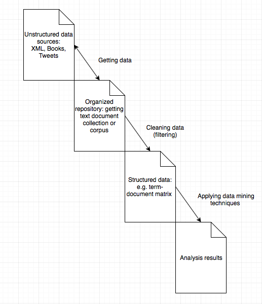

## Overview
More than 80% of today's data is stored in text, most of which is 
in unstructured format as well.

__Popular text sources__

* Web pages 
* RSS Feeds
* Social media i.e. Twitter and Facebook
* Books
* Letters 

Text mining is also referred as text data mining (text analytic). It wants to extract high quality 
information from text. It usually involves getting the data from the source, structuring the input text,
data categorization, text clustering, sentiment analysis, document stigmatization and entity relation modeling. In this series of tutorials, we will introduce a handful of text mining packages in R to demonstrate popular techniques and the text mining infrastructure. First we provide an overview of what are the available packages that we can use.

__Mainstream text mining packages__

| Package Name                                                                  |                             Description       |
|----------------------------------------------------------------------------- |-----------------------------------------------------------------------------	|
| [tm](https://cran.r-project.org/web/packages/tm/index.html)                 	| A framework for text mining applications, very good at manipulating data.  	|
| [wordnet](https://cran.r-project.org/web/packages/wordnet/index.html)       	| An interface to WordNet, a large lexical database of English.               	|
| [textir](https://cran.r-project.org/web/packages/textir/index.html)         	| Tools for analysis of sentiment in text.                                    	|
| [RTextTools](https://cran.r-project.org/web/packages/RTextTools/index.html) 	| Automatic test classification via supervised learning.                      	|
| [wordcloud](https://cran.r-project.org/web/packages/wordcloud/index.html)   	| Various word clouds.                                                        	|
| [LSA](https://cran.r-project.org/web/packages/lsa/index.html)               	| Latex semantic analysis for latent features or topics.                       	|
| [openNLP](https://cran.r-project.org/web/packages/openNLP/index.html)       	| An interface to OpenNLP, a collection of natural language, processing tools. 	|
| [twitterR](https://cran.r-project.org/web/packages/twitteR/README.html)       | A tool that provides access to most of the Twitter API.

Table: Text Ming Packages in R
For a more comprehensive list, please refer to [CRAN Task View: Natural Language Processing](https://cran.r-project.org/web/views/NaturalLanguageProcessing.html)

__Process and framework__

As illustrated in the diagram above, there exist four stages for text mining, unstructured data, organized repository, structured data and analysis results.

* Step 1 getting data: Typically we start with a set of heterogeneous text sources such as Facebook posts, Yelp reviews, books, and some other formats. Those input texts might be located at other places so we organize those sources into tidy set which we can deal with uniformly. Packages such as `twitterR` will allow us to retrieve tweets for analysis or `tm.plugin.mail` will give us mail handling functionality. 
* Sept 2 cleaning data: Once we have an organized repository, we want to process the texts using techniques such as removing white spaces, and stemming procedures, and put those processed text into a structured format that is easy to compute with. A classic approach is to store the word frequency table for each document in a term-document matrix provided by `tm` package. The alternative will to use plain text character sequences for string kernel like methods.
* Step 3 applying data mining techniques: Having the structured data, now we are free to apply data mining techniques as what we will do on other data to obtain the desired results.

__Big Data with R__
Nowadays we are facing with more and more data, we can still use some distributed computing frameworks to tackles those challenges. If you are interested, you can refer to two other tutorials on how to use R with [Hadoop](https://github.com/angerhang/hadoopAndR) and [Spark](http://angerhang.github.io/sparkR/intro) to allow you to deal with large data sets.

In the following tutorials, we will do a series of text mining tasks using some the of packages above to gain a better understanding of what we can do with text mining and how we can do text mining in R.

##References

