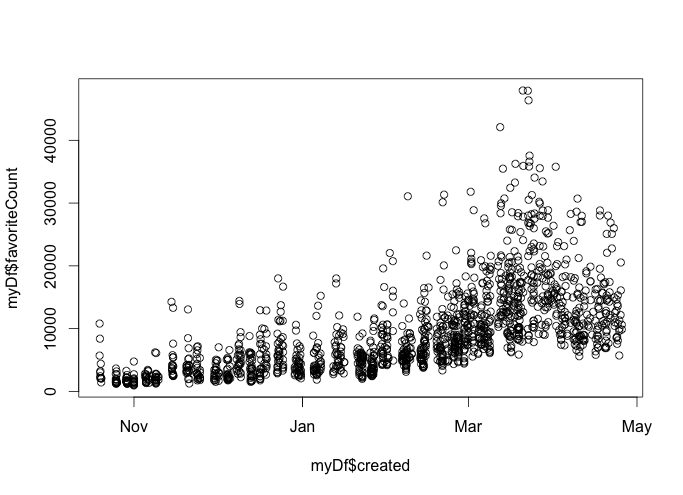

# Twitter R
Data sources of text analysis come in different forms. With the advent of the internet, we have been becoming more and more interested in finding out the trends and conducting analysis on social media. [TwiiterR](https://cran.r-project.org/web/packages/twitteR/) provides us with the access to Twitter's web services. This tutorial will introduce TwitteR from the installation and by the time you go through this tutorial, you will have another great but simple tool in your knowledge base. 

## Installtion
### Install from CRAN
```{r, eval=FALSE}
install.packages("twitteR")
```

### Install from Github
First [download](https://github.com/geoffjentry/twitteR) the repository.
```{r, eval=FALSE}
install.packages(c("devtools", "rjson", "bit64", "httr"))
# Make sure to restart your R session at this point
library(devtools)
install_github("geoffjentry/twitteR")
```

## Steup connection with Twitter
### Create a Twitter application
Go to [here](https://dev.twitter.com) to create a Twitter application and give the app, read, write and direct message permission. In `Keys and Access Tokens`, you will find the `API Key` and `API Secret` which we will use to connect R with Twitter.

### Connect with Twitter
```{r, eval=FALSE}
library(twitteR)
setup_twitter_oauth("API key", "API secret")
```
You might get an error during the authentication, which is caused by the callback url. Just set the # callback URL to `http://127.0.0.1:1410 ` in the app settings in Twitter. 
```{log}
Error in init_oauth1.0(self$endpoint, self$app, permission = self$params$permission,  : 
  Unauthorized (HTTP 401).
```

## Examples 
### Seaching
`searchTwitter` allows us to search for tweets that match a certain term but we can max get tweets from a few days. To know more about what `twitteR` can and can not do, one should consult the [Twitter API](https://dev.twitter.com/overview/documentation)
```{r, eval=FALSE}
tweets <- searchTwitter('#AI', n=40)
head(tweets)
```
```{Output}
[[1]]
[1] "jjlakosta: RT @jose_garde: Demystifying the Role of Artificial Intelligence in #Marketing and #Advertising - eMarketer https://t.co/YQpJREMpR7 via @eM…"

[[2]]
[1] "colinpwcuk: RT @PwCAdvisory: #AI: only a board game champ or a game changer for the enterprise? New #EmergingTech blog: https://t.co/nVlRJrrpvR https:/…"

[[3]]
[1] "wotaslayer: RT @48FamilyINA: BEJ48 &amp; GNZ48 New Logo's!\n\nBEJ48 : Team B &amp; Team E\nGNZ48 : Team G &amp; Team NIII #Ai https://t.co/0OUCFD7rS1"

[[4]]
[1] "Vocation_AI: RT @BernardMarr: Surprised? #BigData And #AI Are Threatening These 10 Professional Jobs - Forbes https://t.co/kL6c1OsX13"

[[5]]
[1] "Vocation_AI: RT @goetten: Surprisingly, These 10 Professional Jobs Are Under Threat From Artificial Inteligence #AI #Data #Expontentials https://t.co/c1…"

[[6]]
[1] "louisebaionnes: RT @jose_garde: Demystifying the Role of Artificial Intelligence in #Marketing and #Advertising - eMarketer https://t.co/YQpJREMpR7 via @eM…"
```

### Get to know user files
We are able to see the followers, tweets and description of a user whose profile is available to you.
```{r, eval=FALSE}
jacobs <- getUser('jacobs_bremen')

jacobs$getDescription()
# [1] "Inspiration is a place! The place is Jacobs University."

jacobs$getFavorites(n=3)
# [[1]]
# [1] "KaiUnzicker: Über #Zusammenhalt mit großartigen Experten an der @jacobs_bremen diskutiert https://t.co/CO74Jhlb6h"

# [[2]]
# [1] "asmkelly: Evaluating oceanographic msrments via #citizenscience. #myosd #oceansamplingday #citsciday #jmbe @jacobs_bremen https://t.co/0Kh8dxKMT7"
```

### Turining tweets into data frame
Sometimes we will want to turn the tweets in data frame for other operations, and this can be easily done:
```{r, eval=FALSE}
myDf <- twListToDF(tweets)
head(myDf)

# text
# 1 RT @jose_garde: Demystifying the Role of Artificial Intelligence in #Marketing and #Advertising - eMarketer https://t.co/YQpJREMpR7 via @eM…
# 2 RT @PwCAdvisory: #AI: only a board game champ or a game changer for the enterprise? New #EmergingTech blog: https://t.co/nVlRJrrpvR https:/…
# 3    RT @48FamilyINA: BEJ48 &amp; GNZ48 New Logo's!\n\nBEJ48 : Team B &amp; Team E\nGNZ48 : Team G &amp; Team NIII #Ai https://t.co/0OUCFD7rS1
# 4                     RT @BernardMarr: Surprised? #BigData And #AI Are Threatening These 10 Professional Jobs - Forbes https://t.co/kL6c1OsX13
# 5 RT @goetten: Surprisingly, These 10 Professional Jobs Are Under Threat From Artificial Inteligence #AI #Data #Expontentials https://t.co/c1…
# 6 RT @jose_garde: Demystifying the Role of Artificial Intelligence in #Marketing and #Advertising - eMarketer https://t.co/YQpJREMpR7 via @eM…
#   favorited favoriteCount replyToSN             created truncated replyToSID                 id replyToUID
# 1     FALSE             0        NA 2016-04-25 14:57:24     FALSE         NA 724613287221039104         NA
# 2     FALSE             0        NA 2016-04-25 14:57:18     FALSE         NA 724613260008415232         NA
# 3     FALSE             0        NA 2016-04-25 14:56:42     FALSE         NA 724613109084626944         NA
# 4     FALSE             0        NA 2016-04-25 14:56:33     FALSE         NA 724613072304914432         NA
# 5     FALSE             0        NA 2016-04-25 14:56:33     FALSE         NA 724613071562543105         NA
# 6     FALSE             0        NA 2016-04-25 14:56:24     FALSE         NA 724613034380013568         NA
#                                                                           statusSource     screenName
# 1                   <a href="http://twitter.com" rel="nofollow">Twitter Web Client</a>      jjlakosta
# 2   <a href="http://twitter.com/download/iphone" rel="nofollow">Twitter for iPhone</a>     colinpwcuk
# 3 <a href="http://twitter.com/download/android" rel="nofollow">Twitter for Android</a>     wotaslayer
# 4                          <a href="https://roundteam.co" rel="nofollow">RoundTeam</a>    Vocation_AI
# 5                          <a href="https://roundteam.co" rel="nofollow">RoundTeam</a>    Vocation_AI
# 6                   <a href="http://twitter.com" rel="nofollow">Twitter Web Client</a> louisebaionnes
#   retweetCount isRetweet retweeted longitude latitude
# 1           19      TRUE     FALSE        NA       NA
# 2            5      TRUE     FALSE        NA       NA
# 3           11      TRUE     FALSE        NA       NA
# 4            4      TRUE     FALSE        NA       NA
# 5            1      TRUE     FALSE        NA       NA
# 6           19      TRUE     FALSE        NA       NA
```

### Timelines
One other info we would like to know is people's timelines:
```{r, eval=FALSE}
jacobs_tweets <- userTimeline('jacobs_bremen')
jacobs_tweets[1:3]

# [[1]]
# [1] "jacobs_bremen: J Cappella Jacobs University Choir returned from the 4th Choirverband Competition in Celle with the \"very good\" Diploma. Congratulations!!"
# 
# [[2]]
# [1] "jacobs_bremen: Do you like our Virtual Campus Tour?  Now you too can vote!!  Tell us what you think! https://t.co/X9m9i6awaY"
# 
# [[3]]
# [1] "jacobs_bremen: HANSE BOAT RACE SATURDAY!  Come on out and cheer our team to victory in Hamburg! @JubRowingTeam https://t.co/3fQjvAFZnH"
```

### Trends 
We also want to the popular trends at a given location and at a given time. The location is defined using `WOEID`:
```{r, eval=FALSE}
availableTrendLocations()
#                     name              country    woeid
# 1              Worldwide                             1
# 2               Winnipeg               Canada     2972
# 3                 Ottawa               Canada     3369
# 4                 Quebec               Canada     3444
# 5               Montreal               Canada     3534

trends = getTrends(1)
head(trends)
#                          name
# 1         #رويه_السعوديه_2030
# 2                 #FelizLunes
# 3                 #RomaNapoli
# 4 #Happy21stBDayDanielPadilla
# 5              #SeEuFosseRico
# 6        Juan Manuel de Prada
```
The above are the popular trends worldwide.

## Popularity of Donald Trump
We can use what we have learnt so far to analyze the changes of Trump's popularity during the last a few months. We first get his last 3200 tweets on his timeline:
```{r, eval=FALSE}
dT <- userTimeline('realDonaldTrump', n = 3200)
length(dT)
# 1520
```
we found out he only has 1520 tweets so far, then we put the retried tweets into a data frame. We plot the favorite counts against time created.
```{r, eval=FALSE}
myDf <- twListToDF(dT)
plot(myDf$created, myDf$favoriteCount)
```


It is clear that Mr. Trump's tweets are getting favored more and more.

## References
Gentry, J. (n.d.). CRAN - Package twitteR. Retrieved April 25, 2016, from https://cran.r-project.org/web/packages/twitteR/index.html
